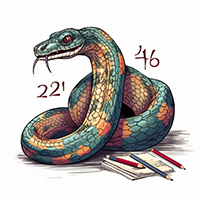

# Discrete Math in Python
Chuck Sailer July 1, 2023

    

 

 

Discrete mathematics forms the basis of many data structures and algorithms. Python, as a programming language, provides several data types and structures that are frequently used in discrete mathematics. Here are some of the most important ones:

1. **Sets:** In Python, sets are used to store multiple items in a single variable, and they are one of Python's four built-in data types for collections, which also include List, Tuple, and Dictionary. In discrete mathematics, sets are used for a variety of purposes, such as to represent collections of objects. Python's set data type supports various set operations like union, intersection, difference, and symmetric difference.

2. **Lists:** In Python, lists are used to store multiple items in a single variable. They are ordered and changeable, allowing duplicate members. Lists are similar to what other languages call arrays, and they can be used in discrete math to represent sequences or ordered lists of elements.

3. **Tuples:** Tuples in Python are used to store multiple items in a single variable. They are ordered and unchangeable, allowing duplicate members. Tuples can be used in discrete mathematics in a similar way to lists, to represent sequences or ordered lists of elements.

4. **Dictionaries:** Python's dictionaries are used to store data values in key-value pairs. A dictionary is a collection which is unordered, changeable, and does not allow duplicates. Dictionaries are similar to what other languages call maps or hash tables. They can be used in discrete mathematics to represent relations or functions.

5. **Booleans:** Booleans represent one of two values: `True` or `False`. In discrete mathematics, boolean values are used in boolean algebra, logic gates, and propositional logic.

6. **Graphs (via libraries):** Python doesn't have a built-in graph data type, but it has several libraries, like NetworkX, that provide sophisticated graph data structures. In discrete mathematics, graphs are used to represent pairwise relationships between objects.

7. **Matrices (via libraries):** Python does not have a built-in matrix data type, but matrices can be handled using nested lists. More typically, numerical libraries such as NumPy are used to work with matrices. In discrete math, matrices are used for a variety of purposes, including the representation of graphs and the solution of systems of linear equations.

These data structures/types can be used to represent and manipulate the various objects of study in discrete mathematics.